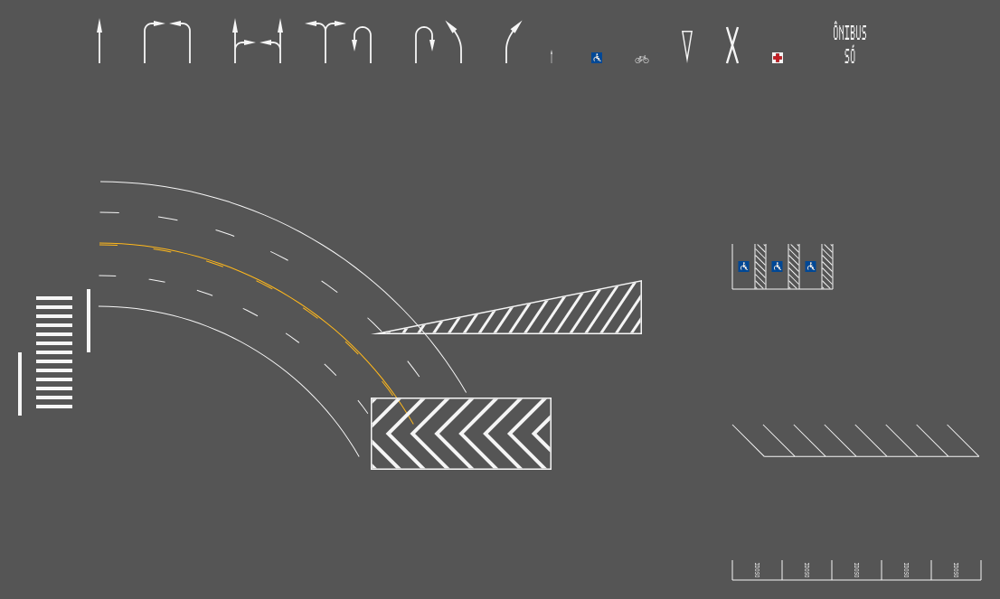

# Sinalização Viária Horizontal para Revit 2027

Plugin para projetar **sinalização viária horizontal paramétrica** dentro do **Autodesk Revit 2027**,
com base no *Manual Brasileiro de Sinalização de Trânsito – Vol. IV (CONTRAN/SENATRAN)*, nas
normas ABNT de acessibilidade (NBR 9050, NBR 16537) e nas práticas do DNIT. Faz no Revit o que
ferramentas como o *SinC* fazem no Civil 3D: você desenha o eixo, escolhe a marca e o plugin gera,
atualiza e quantifica tudo automaticamente.



*Setas PEM, símbolos (SIA, bicicleta, "Dê a preferência", cruz de Santo André, saúde), legenda em
duas linhas, via de mão dupla com LFO-4/LMS-2/LBO em curva, faixa de pedestres com retenção em meia
pista, zebrado ZPA, chevron e vagas PcD, 45° e de idoso. A imagem foi gerada pelos mesmos geradores
que o plugin usa dentro do Revit.*

---

## O que o plugin faz

| Guia **Sinalização Viária** | Recursos |
|---|---|
| **Sinalizar Via** | Gera toda a sinalização longitudinal a partir do eixo e da seção transversal: eixo (LFO-1/2/3/4 ou canteiro), divisórias LMS e bordos LBO, com as dimensões escolhidas pela **velocidade regulamentada**. Mão dupla ou única, larguras de faixa diferentes, recuos, tachas no eixo. |
| **Linha Longitudinal** | LFO-1…4, LMS-1/2, LBO, LCO, faixa exclusiva, faixa reversível, LCA, LPP – ao longo de linhas, arcos e splines. Deslocamento lateral, fase, alinhamento do tracejado (início/fim/centro/ajuste), recuos, inversão de lados (LFO-4). |
| **Faixa de Pedestres** | FTP-1 (zebrada) e FTP-2 (paralela) por dois cliques nos bordos, com **linhas de retenção automáticas** a 1,60 m (editável), em meia pista (mão dupla) ou pista inteira. Barras sempre inteiras e centralizadas. |
| **Linha Transversal** | LRE, LDP, LRV (sequência decrescente de espaçamentos), MCC, FTP… por dois cliques (repete até ESC). |
| **Zebrado** | ZPA branco/amarelo, zebrado rodoviário, **chevron**, área de conflito quadriculada, lombada, faixa adicional PcD – em qualquer contorno fechado (inclusive côncavo), com linha de canalização (LCA). |
| **Setas e Símbolos** | Setas PEM (frente, direita, esquerda, combinadas, retorno), mudança obrigatória de faixa, SIA, bicicleta, "Dê a preferência", cruz de Santo André, serviço de saúde. Comprimentos 5,0 / 7,5 m ou livre. |
| **Legendas** | PARE, ÔNIBUS, ESCOLA, SÓ ÔNIBUS, TÁXI… com **qualquer fonte instalada**, letras alongadas (1,60 / 2,40 / 4,00 m) e ordem de leitura de baixo para cima. |
| **Vagas** | Vagas paralelas ou a 30/45/60/90°, PcD com faixa adicional zebrada e SIA, idoso, moto, carga e descarga, ônibus, táxi, ambulância. Preenche o meio-fio automaticamente ou quantidade fixa. |
| **Complementos** | Tachas e tachões (contagem automática), piso tátil de alerta/direcional (NBR 16537), ciclofaixa (linha, pintura vermelha, MCC). |
| **Editar / Atualizar / 2D-3D / Selecionar conjunto** | Toda marca guarda sua definição: editar reabre a janela com os valores e regenera; converter entre 3D e 2D; selecionar a marca ou o grupo (ex.: a via inteira). |
| **Quantitativos** | Área pintada por código, cor e material, extensão, unidades, consumo estimado de tinta/termoplástico e microesferas, exportação **CSV** (Excel) e **tabela nativa** do Revit. |
| **Configurações / Catálogo / Normas** | Preferências, catálogo normativo em JSON editável e referências normativas. |

### Paramétrico de verdade

* **Associativo**: as marcas ficam ligadas às linhas de modelo/detalhe usadas como caminho. Mova,
  estique ou edite o eixo e **toda a sinalização se regenera sozinha** (Dynamic Model Updater).
* **Editável**: cada elemento guarda a definição completa (Extensible Storage). *Editar* reabre a
  janela com os parâmetros originais.
* **Normativo e configurável**: dimensões, padrões de tracejado, cores, símbolos, vagas e materiais
  vêm de um **catálogo JSON** que você pode ajustar ao manual do seu órgão de trânsito.
* **Cópias inteligentes**: copiar/colar uma marca gera uma marca independente na nova posição.

### Representação no Revit

| Modo | Elemento | Uso |
|---|---|---|
| **Modelo 3D** (padrão) | *DirectShape* na categoria **Modelos genéricos**, sólido fino com material por cor (preenchimento sólido visível em planta) | Plantas, cortes, 3D, renderização, tabelas, filtros de vista. Pode **acompanhar Toposolid/pisos/topografia** (projeção sobre o greide). |
| **Detalhe 2D** | **Região preenchida** na vista ativa (tipos "SV - Branca", "SV - Amarela"...) | Pranchas de sinalização em vistas de planta ou de desenho. |

Parâmetros compartilhados de instância (**SV_Codigo, SV_Descricao, SV_Grupo, SV_Cor, SV_Material,
SV_Area, SV_Extensao, SV_Quantidade, SV_Referencia, SV_Id**) são criados automaticamente, permitindo
tabelas, etiquetas e filtros de vista nativos.

---

## Instalação (copiar e colar – sem instalar nada)

A pasta **[`Instalar/Revit2027`](Instalar/Revit2027)** já traz o plugin compilado, com apenas **2 arquivos**:

| Arquivo | O que é |
|---|---|
| `SinalizacaoViaria.addin` | Manifesto que o Revit lê ao iniciar |
| `SinalizacaoViaria.dll` | O plugin completo (núcleo e bibliotecas incluídos numa única DLL) |

1. Feche o Revit.
2. Copie os **dois arquivos** para `%AppData%\Autodesk\Revit\Addins\2027`
   (ou `C:\ProgramData\Autodesk\Revit\Addins\2027` para todos os usuários). Eles devem ficar juntos
   na mesma pasta.
3. Se vieram da internet: botão direito na DLL → *Propriedades* → **Desbloquear**.
4. Abra o Revit 2027 e escolha **"Sempre carregar"** no aviso de add-in não assinado.

Não é necessário .NET SDK nem outro programa: o Revit 2027 já inclui o runtime .NET 10. A DLL foi
compilada contra a API da primeira versão do Revit 2027, portanto funciona em qualquer atualização
2027.x. Instruções detalhadas em [`Instalar/LEIA-ME.txt`](Instalar/LEIA-ME.txt).

Para atualizar, substitua os dois arquivos; para desinstalar, apague-os. (Opcionalmente,
`install.ps1` faz essa cópia automaticamente.)

> Para desenvolvedores: `dotnet build src/SinalizacaoViaria.Revit -c Release` (requer .NET 10 SDK)
> recompila e atualiza a pasta `Instalar/Revit2027`; no Windows também copia para a pasta de Add-ins.

---

## Início rápido

1. Numa **vista em planta**, desenhe o eixo da via com *Linha de modelo* (linhas, arcos, splines) ou
   use **Desenhar Eixo**.
2. **Sinalizar Via** → informe faixas, velocidade e tipo de eixo → *Criar* → selecione o eixo.
3. **Faixa de Pedestres** → *Criar* → clique os dois bordos da pista.
4. **Setas e Símbolos** / **Legendas** → clique a base e o sentido do tráfego.
5. Mova o eixo: tudo acompanha. Use **Editar** para mudar qualquer parâmetro.
6. **Quantitativos** → exporte o CSV ou crie a tabela no Revit.

Manual completo: [docs/MANUAL.md](docs/MANUAL.md) · Catálogo: [docs/CATALOGO.md](docs/CATALOGO.md) ·
Arquitetura: [docs/ARQUITETURA.md](docs/ARQUITETURA.md)

---

## Normas e responsabilidade técnica

Os valores padrão do catálogo foram compilados a partir do **MBST Vol. IV – Sinalização Horizontal**
(aprovado pela Resolução CONTRAN nº 236/2007) e de práticas usuais de projeto (DNIT, órgãos
municipais). Referências consideradas: MBST, CTB e resoluções do CONTRAN, Manual de Sinalização
Rodoviária do DNIT, ABNT NBR 9050, NBR 16537, NBR 14723, NBR 15405, NBR 15870 e NBR 14282.

**O plugin é uma ferramenta de produtividade; a responsabilidade pelo projeto é do profissional.**
Confira sempre a edição vigente do manual, as resoluções do CONTRAN/SENATRAN e as exigências do órgão
com circunscrição sobre a via. Todos os valores são editáveis no catálogo. Os valores marcados como
"exemplo" (ex.: sequências de LRV) devem ser ajustados ao estudo de cada local.

---

## Desenvolvimento

```
src/SinalizacaoViaria.Core     Núcleo independente do Revit (net10.0): geometria, catálogo, geradores,
                               definições paramétricas, automações, quantitativos. Roda em qualquer SO.
src/SinalizacaoViaria.Revit    Plugin (net10.0-windows, WPF): faixa de opções, comandos, janelas,
                               renderização DirectShape/FilledRegion, Extensible Storage, DMU.
                               Compila o núcleo junto, gerando uma DLL única.
Instalar/Revit2027             Pacote pronto: SinalizacaoViaria.dll + SinalizacaoViaria.addin.
tests/SinalizacaoViaria.Core.Tests   77 testes xUnit do núcleo.
```

```bash
dotnet test tests/SinalizacaoViaria.Core.Tests     # funciona em Windows, Linux ou macOS
dotnet build src/SinalizacaoViaria.Revit           # referências da API do Revit 2027 via NuGet
```
