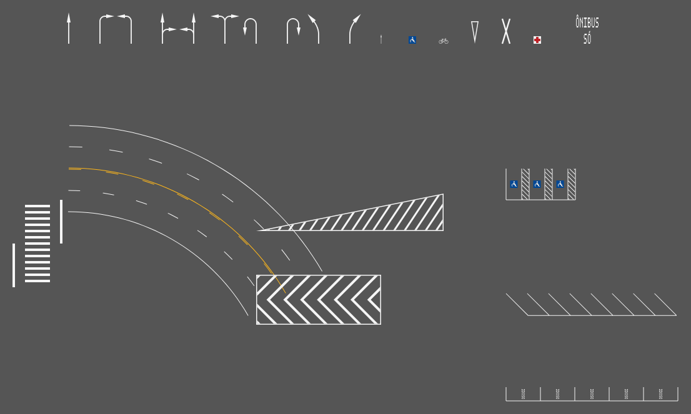

# SinalizaBIM – Sinalização viária e urbanização para Revit 2027

**SinalizaBIM** é um plugin para projetar **sinalização viária horizontal e vertical paramétrica, urbanização e moderação de tráfego** dentro do **Autodesk Revit 2027**,
com base no *Manual Brasileiro de Sinalização de Trânsito – Vol. IV (CONTRAN/SENATRAN)*, nas
normas ABNT de acessibilidade (NBR 9050, NBR 16537) e nas práticas do DNIT. Faz no Revit o que
ferramentas como o *SinC* fazem no Civil 3D: você desenha o eixo, escolhe a marca e o plugin gera,
atualiza e quantifica tudo automaticamente.



*Setas PEM, símbolos (SIA, bicicleta, "Dê a preferência", cruz de Santo André, saúde), legenda em
duas linhas, via de mão dupla com LFO-4/LMS-2/LBO em curva, faixa de pedestres com retenção em meia
pista, zebrado ZPA, chevron e vagas PcD, 45° e de idoso. A imagem foi gerada pelos mesmos geradores
que o plugin usa dentro do Revit.*

---

## O que o plugin faz

| Guia **SinalizaBIM** | Recursos |
|---|---|
| **Sinalizar Via** | Monta a **seção transversal completa** a partir do eixo, com modelos prontos: faixas de rolamento, **exclusivas e preferenciais** de ônibus (linha MFE + legenda ÔNIBUS repetida + **fundo colorido opcional**), **ciclofaixas** (pintura vermelha, bicicletas, setas, segregadores), **faixa de estacionamento** (vagas de qualquer tipo), **acostamento**, **faixa de segurança/transição** zebrada, **canteiros central e laterais** (físicos ou pintados), **calçadas** (meio-fio, faixa de serviço, faixa livre NBR 9050, faixa de acesso) e dispositivos de segregação. As linhas entre os elementos (LFO, LMS, MFE, CIC-LD, LBO) são escolhidas automaticamente pela velocidade. **Várias linhas selecionadas de uma vez viram várias vias** (as alinhadas continuam a mesma via; as que se encontram em T ou em cruz viram vias próprias) **com todas as interseções criadas**; uma via nova na **ponta** de outra, em ângulo, vira uma **emenda concordada** (pista, calçadas, canteiro e linhas seguem por uma curva, com transição de largura) em vez de um cruzamento com falhas. **Pistas feitas com Piso comum** (projetos antigos) viram vias do plugin: selecione os pisos e os eixos, larguras e encontros são reconhecidos, sem duplicar o pavimento. |
| **Linha Longitudinal** | LFO-1…4, LMS-1/2, LBO, LCO, faixa exclusiva, faixa reversível, LCA, LPP – ao longo de linhas, arcos e splines. Deslocamento lateral, fase, alinhamento do tracejado (início/fim/centro/ajuste), recuos, inversão de lados (LFO-4). |
| **Faixa de Pedestres** | FTP-1 (zebrada) e FTP-2 (paralela) por dois cliques nos bordos, com **linhas de retenção automáticas** a 1,60 m (editável), em meia pista (mão dupla) ou pista inteira. Barras sempre inteiras e centralizadas. |
| **Linha Transversal** | LRE, LDP, LRV (**espaçamento decrescente calculado pelo método do MBST Vol. IV** a partir das velocidades inicial e final), MCC, MCF, FTP… por dois cliques (repete até ESC). |
| **Zebrado** | ZPA branco/amarelo, zebrado rodoviário, **chevron**, área de conflito quadriculada, MAE, lombada, faixa adicional PcD – em qualquer contorno fechado (inclusive côncavo), **com furos (anel em volta de rotatórias e ilhas)** ou como **faixa de largura fixa ao longo de um contorno** (lado interno/externo), com linha de canalização (LCA). **Canalização (MTL / MAO / MAP)**: área neutra de transição de largura, aproximação de obstáculo ou acostamento, dimensionada pela velocidade (l = 0,5·V·d, barras a 1,50/2,50 m) ao longo de uma linha de referência. |
| **Setas e Símbolos** | Setas PEM (frente, direita, esquerda, combinadas, retorno), mudança obrigatória de faixa, SIA, bicicleta, "Dê a preferência", cruz de Santo André, serviço de saúde. Comprimentos 5,0 / 7,5 m ou livre, com **escala (%)**. |
| **Legendas** | PARE, ÔNIBUS, ESCOLA, SÓ ÔNIBUS, TÁXI… com **qualquer fonte instalada**, letras alongadas (1,60 / 2,40 / 4,00 m) e ordem de leitura de baixo para cima; **escala (%)** da legenda inteira. |
| **Vagas** | Vagas paralelas ou a 30/45/60/90°, PcD com faixa adicional zebrada e SIA, idoso, moto, carga e descarga, ônibus, táxi, ambulância. Preenche o meio-fio automaticamente ou quantidade fixa. |
| **Calçada e Canteiro** | Calçadas, meios-fios e canteiros gramados (3D, 0,15 m de altura) ao longo de qualquer linha. |
| **Bloqueios Físicos** | Segregadores (tartarugas), tachões, balizadores flexíveis, cilindros delimitadores, pilaretes/frades, prismas de concreto, separador contínuo, barreira New Jersey (contínua ou modular "gelo baiano"), barreira plástica, defensa metálica (**guard rail – agora dentro de Bloqueios Físicos, sem ferramenta duplicada**), **esfera e floreira de concreto, gradil, cone, cavalete e tambor**, lista agrupada por família – em 3D com **forma real** (perfil New Jersey padronizado, lâmina em "W", faixas refletivas, módulos vermelho/branco), contados por unidade ou metro. |
| **Placas** (Sinalização Vertical) | **Série completa**: regulamentação R-1 a R-40, advertência A-1a a A-48, serviços auxiliares, turísticas, educativas, indicação, informações complementares e obras (168 placas, com **pictograma desenhado**, descrição e miniaturas com pesquisa), em 3D com coluna simples ou dupla, **braço projetado, semipórtico ou pórtico** (vão, colunas e viga editáveis, altura livre de 5,50 m), altura livre de 2,10 m, orla, fundo e legenda editável (ex.: velocidade). Face voltada automaticamente para o tráfego. |
| **Meio-fio e Sarjeta** | Meios-fios (0,15, 0,12, alto, rebaixado, com sarjeta conjugada), sarjetas, **sarjetões com perfil côncavo real que recortam a pista** (travessia de águas), calçadas, gramados e **faixas de caminhada azuis ou verdes**. |
| **Rampas** | Rebaixamentos de calçada NBR 9050 modelados como **sólidos inclinados reais** (rampa com a inclinação exata, abas triangulares a 10 %, piso tátil de alerta acompanhando a rampa, direcional opcional), **rebaixamento total** da calçada com rampas laterais e guias rebaixadas de veículos – **recortam a calçada e o meio-fio automaticamente**. Em 2D mostram a seta de subida e a inclinação. |
| **Quebra-mola e Lombadas** | Ondulações transversais tipo A e B, faixa elevada para travessia (com zebrado no platô e triângulos nas rampas), lombada invertida e **almofadas (speed cushion, uma por faixa – CET-SP)** – volume 3D com a pintura acompanhando o perfil. |
| **Área de Conflito** | Quadriculado amarelo em cruzamentos. |
| **Elementos Urbanos** | Redesenhados em 3D e planta: árvores (copa em lóbulos), palmeiras, arbustos, bancos de ripas, lixeiras, postes com braço curvo e de pedestres, abrigos de ônibus, paraciclos, hidrantes, floreiras, placas de rua e semáforos – por ponto ou distribuídos ao longo de um caminho. **Famílias do Revit** do usuário (qualquer componente, com o design que quiser) inseridas por cliques ou ao longo de linhas – ou já existentes – classificadas por **subcategoria** (iluminação, arborização, bancos, lixeiras, abrigos…) e detalhadas no quantitativo. |
| **Complementos** | Tachas e tachões **com forma real** (corpo chanfrado/trapezoidal e faces refletivas; contagem automática, espaçamentos das Tabelas 4.6/4.7 do MBST Vol. VI), **rota tátil NBR 16537** (placas moduladas com relevo – barras direcionais e domos de alerta automáticos nas mudanças de direção, extremos e junções), **ciclovia / faixa de caminhada completa** (fundo, linhas, símbolos, setas e segregadores num só comando, sem sobreposições; **padrão II da CET** com linha vermelha de contraste), **cruzamento rodoferroviário completo** (linha de retenção dupla paralela ao trilho, retângulo de advertência com cruz de Santo André por faixa, LFO-3, PARE, LRV e placas A-41/R-1/A-39/A-40 – MBST Vol. IX e DER-SP). |
| **Montagem passo a passo e pisos** | **Pista** (só a parte dos veículos, já conectada) + meio-fio, calçada, grama e sarjeta **junto ao bordo da via**, empilhados e incorporados às conexões. **Modelos de via personalizados** salvos. Pavimentos, calçadas, meios-fios, sarjetas e grama – **inclusive nas interseções** – como **Piso do Revit** (contorno editável; edições manuais são preservadas). Qualquer ferramenta por linha aceita **bordas de pisos/lajes/topografia** como referência e a **posição em relação à linha** (centro ou borda, com o lado indicado por clique). Interseções automáticas simples (PARE, linhas da principal contínuas). Orelhas com cada ponta em curva, chanfro ou reta. **Curvas do eixo arredondadas** (borda interna e linhas acompanham), pisos que **acompanham o terreno** com a edição de forma nativa, faixas de pedestres que **se sobrepõem** às linhas, lombada invertida que recorta a pista e rampas totalmente dimensionáveis. Faixa de opções enxuta com botões agrupados. |
| **Nova via conectada e hierarquia viária** | **Ímã de conexão (como no InfraWorks)**: puxe a ponta de qualquer eixo até o meio de outra via e ela se conecta sozinha, em qualquer ângulo; vias ligadas acompanham quando a outra é movida. **Via** desenhada por pontos (com curvas concordadas; o antigo *Nova Via* foi unificado em *Via*, que agora usa a mesma montagem e conexão da *Pista*) que se encaixa nas vias existentes – na ponta (continuação), no eixo (T/cruzamento) ou numa rotatória (novo ramo) – e o sistema viário se ajusta sozinho: interseção ou rotatória nos encontros e **cul-de-sac** nas pontas livres, sempre ligados às vias. **Conexão** troca o tratamento de qualquer encontro ou ponta. Toda via recebe a **hierarquia viária (CTB art. 60)**, gravada em todos os elementos (SV_Hierarquia) e usada nos quantitativos (resumo por hierarquia), na via preferencial e no raio das esquinas – o **raio de concordância das esquinas (guia)** pode ser informado na criação da via e alterado depois. |
| **Pavimento, interseções e rotatórias** | O **Sinalizar Via** gera o **pavimento** (asfalto, bloquete ou concreto) e **ajusta automaticamente os cruzamentos e entroncamentos** com as vias existentes — também ao mover ou editar eixos, e em vias de versões anteriores: qualquer ângulo (ortogonal, oblíquo, T, Y, vários ramos), esquinas com qualquer raio e meio-fio curvo, calçadas contornando a curva e canteiros refeitos, sinalização interrompida, vagas removidas a 5 m da esquina, faixas de pedestres e rampas; controle por **PARE / Dê a preferência / Semáforo** na via secundária (LRE/LDP, legendas, R-1/R-2) e os tipos **II – ilha gota**, **III – faixa de conversão livre com ilha** e **IV – bolsão de conversão à esquerda** (físicos ou pintados). **Rotatórias** de vários tipos – **mini (ilha pintada com LCA + tachões), compacta, 1 faixa, 2 faixas, turbo (divisores físicos), oval, com by-pass, elevada (platô com rampas) e com ilha em calota rampada** – com valores de referência e **personalização total**: **modo de integração** (completa, **só o anel** ou **só a ilha**, sem refazer o cruzamento inteiro), recorte das vias opcional, **cada ramo** com mão dupla/única, ilha separadora física/pintada/nenhuma, travessia, raios e controle (dê a preferência ou PARE), marcação do anel conforme o MBST (LBO, LMS, setas IMC, LDP + SDP pela velocidade, LFO-3) e placas R-2/R-33 ou R-24a, A-12 "A … m" e marcadores de alinhamento (DER-SP projetos-tipo 15/16); linha de bordo no meio-fio real, travessia de calçada a calçada sobre o by-pass e refúgios nas ilhas. **Regras de conversão (CTB art. 207)** nas interseções: LCO tracejada no miolo e na boca das transversais, LFO-3/LMS-1 nas aproximações e opção de proibir a esquerda (eixo contínuo + R-4a). |
| **Calçadas** | **Orelha de calçada** (avanço sobre o estacionamento, em meio de quadra ou **contornando a esquina**, com curvas reversas ou chanfro, meio-fio, canteiro e árvores), **área de calçada por contorno** (esquinas, ilhas, parklets, ciclovia no nível da calçada, faixa de serviço, cantos arredondados), **canteiros/jardineiras/grelhas de árvore** e **cul-de-sac** (circular, excêntrico, gota, T, Y e L, com ilha e linha de bordo) – recortando automaticamente as marcas e calçadas sob eles. |
| **Detalhamento** | **Detalhar Placas**: na planta, cada placa aparece ampliada ao lado do suporte, com linha de chamada (reta, cotovelo ou **livre – arraste para onde quiser com Mover Chamada de Placa**), ponto ou seta, número em balão e código/nome (ex.: *R-1 Parada obrigatória*) – tamanhos em mm de papel, acompanhando a escala da vista e a edição da placa. **Anotar**: chamada com texto automático para qualquer sinalização (código, nome, largura, padrão, espaçamento…). **Quadro de Legenda**: amostra desenhada + descrição de cada tipo usado no projeto, atualizado automaticamente. **Mostrar/Ocultar Eixos** na vista ativa. **Cotar Seção** (cadeia de cotas eixo a eixo com **nome de cada trecho**, eixo traço-ponto, cota total, marcas de corte, perfil com **caimento real** – duas águas ou superelevação na pista, calçada subindo para o lote, níveis reais – e título SEÇÃO A–A com a via e a estaca do corte), **Detalhe Típico** cotado (linhas, zebrados, vagas e placa em elevação), **Quadro de Quantitativos** e **Quadro de Placas** (com numeração P01, P02...) na prancha, **Notas Gerais** (com modelos prontos por disciplina) e **Norte** (3 estilos). |
| **Editar / Atualizar / 2D-3D / Selecionar conjunto** | Toda marca guarda sua definição: editar reabre a janela com os valores e regenera – num elemento de via, escolha **só o elemento, a via inteira (seção transversal guardada, regenerada sobre o mesmo eixo) ou o pavimento/raios**; converter entre 3D e 2D; selecionar a marca ou o grupo (ex.: a via inteira). |
| **Quantitativos** | **Memorial** para placas, dispositivos, mobiliário, moderação e acessibilidade (uma linha por modelo, sem cor/material) e **quantidades por cor e material** na sinalização horizontal. Janela com **cartões de resumo**, grupos recolhíveis **categoria → subcategoria** com subtotais, amostra de cor e detalhes por item; **separados por categoria** (horizontal, vertical, dispositivos, acessibilidade, calçadas/urbanização, moderação, mobiliário) com filtro, pesquisa e subtotais; área pintada por código, cor e material, extensão, unidades, consumo estimado de tinta/termoplástico e microesferas, exportação **CSV** (Excel) e **tabela nativa** do Revit. |
| **Largura variável, recuos e calçadas em nível** | Largura **meio-fio a meio-fio, sarjeta e alinhamento variáveis** ao longo do eixo (pontos por estaca, transição linear ou em S, **leitura dos meios-fios e muros do levantamento**), **baias de ônibus** e **faixas de aceleração/desaceleração** que recuam a calçada (MVE, ÔNIBUS, LCO, setas, placa e abrigo), **Recuo na Via** para acrescentar, alterar ou remover baias e faixas auxiliares numa via já criada (Editar sobre a marca do recuo), **calçadas com inclinação transversal e níveis do alinhamento** (faixa de acesso em rampa para edificações mais altas), **LCO tracejada** atravessando a boca das vias secundárias conforme a hierarquia e **sinalização horizontal como Piso do Revit** (edição fácil). |
| **Segurança viária** | **Sonorizador longitudinal** (fresado, termoplástico com relevo, barras ou tachas; dimensões, espaçamento, ângulo, cor e interrupções para ciclistas) e **área de escape de caminhões** (caixa de retenção dimensionada por L = V²/254(R+G), leito com transição de profundidade, faixa de serviço com âncoras, berma, zebrado e delineadores). |
| **Simulador de Tráfego** | Lê o projeto inteiro (vias, faixas, sentidos, hierarquia, velocidades, interseções e seus controles, rotatórias, balões, placas, travessias, vagas, lombadas e greide), estima a demanda (ou usa as contagens informadas), aloca o tráfego por equilíbrio e calcula **capacidade, atraso e nível de serviço A–F (HCM)** de cada cruzamento e trecho, com **plano semafórico otimizado** (Webster, fase protegida à esquerda). **Microssimulação animada** dos veículos (seguimento IDM, brechas, PARE, rotatória, semáforo, pedestres) e **diagnóstico com recomendações** – capacidade, segurança, sinalização, CTB, NBR 9050. Mapa de níveis de serviço desenhado na planta e relatório TXT/CSV. **Cenários salvos no projeto** com contagens classificadas e ajustes por cruzamento (controle, ciclo, verdes), **planos semafóricos gravados na interseção**, **coordenação (onda verde)**, baias e pontos de ônibus, faixas auxiliares, bolsões e estreitamentos lidos do projeto, **troca de faixa** e ônibus parando na simulação, **pontos de conflito e acidentes previstos (HSM)**, **custos anuais**, **comparação de cenários** e resultados gravados nos elementos (SV_NivelServico, SV_Trafego). **Lê toda a sinalização projetada** – placas de regulamentação (PARE, preferência, sentido proibido, conversões proibidas, movimentos obrigatórios, velocidade máxima, ultrapassagem, troca de faixa, estacionamento, caminhões, exclusivas), linhas (LFO, LMS, LRE, LDP, LRV, MCF), legendas, setas por faixa, zebrados e canalizações, barreiras e separadores centrais, balizadores, cones e bloqueios, semáforos – e adapta rotas, capacidade e simulação a cada uma (aba **Sinalização** com o efeito e o motivo de cada item, e **Reler o projeto**). Mapa com a **planta real do projeto** (pavimento, calçadas, canteiros e toda a pintura geradas pelo plugin), carros/ônibus/caminhões detalhados com luz de freio e **seta piscando**, ícones da sinalização e painel da animação. **Microssimulação coesa**: com muito tráfego há fila e lentidão, nunca veículos se atravessando (zonas de conflito, não bloquear o cruzamento, anel da rotatória sem travamento). **Semáforos**: clique no mapa (cruzamento ou travessia no meio da quadra) ou escolha um elemento do Revit, tempos por semáforo (ciclo, verdes, entreverdes, defasagem) e **recomendação de tempos** para um, todos ou todos os cruzamentos de uma via com **onda verde**. **Testar soluções**: para cada problema o simulador roda as alternativas (semaforizar, PARE, rotatória, retemporizar, onda verde, proibir esquerdas, tempos da travessia) e mostra o antes × depois; cada solução traz o **pacote completo de projeto** (semáforos, placas, LRE, travessias com rampas e piso tátil, bolsões, bloqueio de conversões, plano semafórico) com a norma de cada item, só é recomendada se atender ao **critério do MBST Vol. V** (volumes mínimos) e pode ser **aplicada direto no PROJETO** com um clique (um único Desfazer). Botão **🚦 Semáforos** na faixa de opções e aba própria com tabela de todos os semáforos, menu do botão direito no mapa e dica na primeira abertura. Simulação com passo de 0,25 s, motoristas diferentes entre si e pedestres visíveis nas travessias. |
| **Configurações / Catálogo / Normas** | Preferências, catálogo normativo em JSON editável e referências normativas. |

### Paramétrico de verdade

* **Associativo**: as marcas ficam ligadas às linhas de modelo/detalhe usadas como caminho. Mova,
  estique ou edite o eixo e **toda a sinalização se regenera sozinha** (Dynamic Model Updater).
* **Editável**: cada elemento guarda a definição completa (Extensible Storage). *Editar* reabre a
  janela com os parâmetros originais.
* **Normativo e configurável**: dimensões, padrões de tracejado, cores, símbolos, vagas e materiais
  vêm de um **catálogo JSON** que você pode ajustar ao manual do seu órgão de trânsito.
* **Prévia 3D**: todas as janelas de criação têm o botão *3D / Planta* na pré-visualização, com a vista isométrica do elemento.
* **Cópias inteligentes**: copiar/colar uma marca gera uma marca independente na nova posição.

### Representação no Revit

| Modo | Elemento | Uso |
|---|---|---|
| **Modelo 3D** (padrão) | *DirectShape* na categoria **Modelos genéricos**, sólido fino com material por cor (preenchimento sólido visível em planta) | Plantas, cortes, 3D, renderização, tabelas, filtros de vista. Pode **acompanhar Toposolid/pisos/topografia** (projeção sobre o greide). |
| **Detalhe 2D** | **Região preenchida** na vista ativa (tipos "SV - Branca", "SV - Amarela"...) | Pranchas de sinalização em vistas de planta ou de desenho. |
| **Detalhamento** | Regiões preenchidas + **textos** (tipos "SV - Texto 2.0 mm"...) + **linhas de detalhe** (estilo "SV - Chamada") na vista | Símbolos de placas, anotações e quadro de legenda – sempre ligados à marca de origem. |

Parâmetros compartilhados de instância (**SV_Codigo, SV_Descricao, SV_Grupo, SV_Cor, SV_Material,
SV_Area, SV_Extensao, SV_Quantidade, SV_Referencia, SV_Id**) são criados automaticamente, permitindo
tabelas, etiquetas e filtros de vista nativos.

---

## Instalação (copiar e colar – sem instalar nada)

A pasta **[`Instalar/Revit2027`](Instalar/Revit2027)** já traz o plugin compilado, com apenas **2 arquivos**:

| Arquivo | O que é |
|---|---|
| `SinalizaBIM.addin` | Manifesto que o Revit lê ao iniciar |
| `SinalizaBIM.dll` | O plugin completo (núcleo e bibliotecas incluídos numa única DLL) |

1. Feche o Revit.
2. Copie os **dois arquivos** para `%AppData%\Autodesk\Revit\Addins\2027`
   (ou `C:\ProgramData\Autodesk\Revit\Addins\2027` para todos os usuários). Eles devem ficar juntos
   na mesma pasta.
3. Se vieram da internet: botão direito na DLL → *Propriedades* → **Desbloquear**.
4. Abra o Revit 2027 e escolha **"Sempre carregar"** no aviso de add-in não assinado.

Não é necessário .NET SDK nem outro programa: o Revit 2027 já inclui o runtime .NET 10. A DLL foi
compilada contra a API da primeira versão do Revit 2027, portanto funciona em qualquer atualização
2027.x. Instruções detalhadas em [`Instalar/LEIA-ME.txt`](Instalar/LEIA-ME.txt).

Para atualizar, substitua os dois arquivos; para desinstalar, apague-os. (Opcionalmente,
`install.ps1` faz essa cópia automaticamente.)

> Para desenvolvedores: `dotnet build src/SinalizacaoViaria.Revit -c Release` (requer .NET 10 SDK)
> recompila e atualiza a pasta `Instalar/Revit2027`; no Windows também copia para a pasta de Add-ins.

---

## Início rápido

1. Numa **vista em planta**, desenhe o eixo da via com *Linha de modelo* (linhas, arcos, splines) ou
   use **Desenhar Eixo**.
2. **Sinalizar Via** → informe faixas, velocidade e tipo de eixo → *Criar* → selecione o eixo.
3. **Faixa de Pedestres** → *Criar* → clique os dois bordos da pista.
4. **Setas e Símbolos** / **Legendas** → clique a base e o sentido do tráfego.
5. Mova o eixo: tudo acompanha. Use **Editar** para mudar qualquer parâmetro.
6. **Quantitativos** → exporte o CSV ou crie a tabela no Revit.

Manual completo: [docs/MANUAL.md](docs/MANUAL.md) · Catálogo: [docs/CATALOGO.md](docs/CATALOGO.md) ·
Arquitetura: [docs/ARQUITETURA.md](docs/ARQUITETURA.md)

---

## Normas e responsabilidade técnica

Os valores padrão do catálogo foram compilados a partir do **MBST Vol. IV – Sinalização Horizontal**
(aprovado pela Resolução CONTRAN nº 236/2007) e de práticas usuais de projeto (DNIT, órgãos
municipais). Referências consideradas: MBST, CTB e resoluções do CONTRAN, Manual de Sinalização
Rodoviária do DNIT, ABNT NBR 9050, NBR 16537, NBR 14723, NBR 15405, NBR 15870 e NBR 14282.

**O plugin é uma ferramenta de produtividade; a responsabilidade pelo projeto é do profissional.**
Confira sempre a edição vigente do manual, as resoluções do CONTRAN/SENATRAN e as exigências do órgão
com circunscrição sobre a via. Todos os valores são editáveis no catálogo. Os valores marcados como
"exemplo" (ex.: sequências de LRV) devem ser ajustados ao estudo de cada local.

---

## Desenvolvimento

```
src/SinalizacaoViaria.Core     Núcleo independente do Revit (net10.0): geometria, catálogo, geradores,
                               definições paramétricas, automações, quantitativos. Roda em qualquer SO.
src/SinalizacaoViaria.Revit    Plugin (net10.0-windows, WPF): faixa de opções, comandos, janelas,
                               renderização DirectShape/FilledRegion, Extensible Storage, DMU.
                               Compila o núcleo junto, gerando uma DLL única.
Instalar/Revit2027             Pacote pronto: SinalizaBIM.dll + SinalizaBIM.addin.
tests/SinalizacaoViaria.Core.Tests   105 testes xUnit do núcleo.
```

```bash
dotnet test tests/SinalizacaoViaria.Core.Tests     # funciona em Windows, Linux ou macOS
dotnet build src/SinalizacaoViaria.Revit           # referências da API do Revit 2027 via NuGet
```
